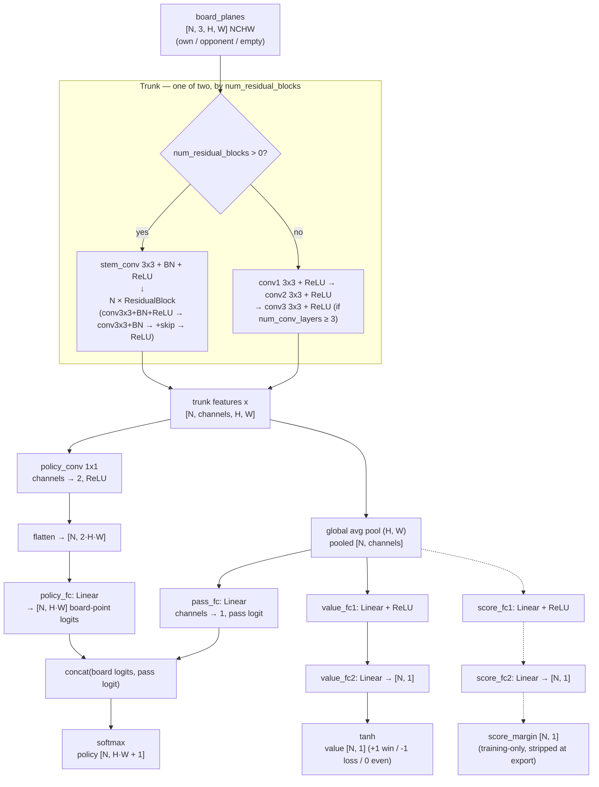

# bootstrap/

The neural net itself, and the training loop that fits it to data —
whether that data came from `selfplay/generate.py`'s distillation or
`selfplay/self_play.py`'s real self-play. "Bootstrap" names the original
purpose (Phase 2's imitation-learning warm start before any self-play
existed), but this module trains every generation, not just the first.

## The net: `model.py`'s `RayZeroNet`

A standard AlphaZero/KataGo-shaped policy/value net, `torch.nn.Module`.
Schematically (dashed edges only exist when `has_score_head=True`):

- The trunk's two paths are mutually exclusive per checkpoint (never both
  in the same forward pass) — which one exists is fixed at construction by
  `num_residual_blocks`, not chosen dynamically per call.
- `pooled` (the trunk's global-average-pooled features) is shared by three
  independent heads: the pass logit, the value head, and — when present —
  the score head. Only the spatial board-point logits come from
  `policy_conv`/`policy_fc` instead.
- `policy`'s `board_size**2 + 1` index convention (board points row-major,
  then a trailing pass slot) is `docs/MODEL_CONTRACT.md`'s contract, not
  incidental to this diagram — `bootstrap/dataset.py`'s policy targets and
  `igo-app/inference/TfLitePolicyValueNet.kt`'s decoder both assume exactly
  this layout.

In prose:

- **Trunk**: either a plain stack of `num_conv_layers` (2 or 3) same-padded
  3x3 convolutions, or — the current, stronger architecture — a `stem_conv`
  followed by `num_residual_blocks` `ResidualBlock`s (two 3x3 convs each,
  BatchNorm, skip connection, final ReLU; see the class docstring). Which
  path runs is decided by `num_residual_blocks > 0`; both stay supported so
  a checkpoint saved under any point in this project's architecture history
  (documented in the module docstring: 2 layers → 3 layers → residual
  tower, each swap made after confirming the previous shape had hit a
  capacity ceiling on real data) keeps loading correctly.
- **Policy head**: a 1x1 conv down to 2 channels, flattened and projected
  to `board_size**2` board-point logits — plus a *separate* branch
  (`pass_fc`, fed from the trunk's globally-average-pooled features, not
  the spatial policy map) producing the trailing pass logit. Both get
  concatenated and softmaxed together into one `board_size**2 + 1` policy
  distribution, matching `docs/MODEL_CONTRACT.md`'s row-major-plus-pass
  index convention exactly.
- **Value head**: pooled trunk features → a hidden linear layer → `tanh`,
  giving the `[-1, 1]` expected-outcome estimate for the player to move.
- **Auxiliary score-margin head** (`has_score_head=True` only, every
  checkpoint before 2026-09-03 has it off): a second small head predicting
  final area-score margin, not used for actual play (stripped at export —
  see `export/to_tflite.py`) and not the primary training signal either.
  It exists purely to regularize the value head against saturating flat
  near ±1 with no signal distinguishing an efficient win from a lucky one
  — see the module docstring for the real self-play collapse this was
  diagnosed against, and `docs/SELF_PLAY_STABILITY.md`.

`forward()` always returns `(policy, value, score_margin)`, with
`score_margin` as `None` when `has_score_head` is off.

## The training loop: `train.py`

Standard AlphaZero-style loss: cross-entropy between predicted and target
policy distributions (a *soft* target — the opponent's actual move for
`generate.py` data, or the search's visit-count distribution for
`self_play.py` data — not a single hard label), plus MSE between predicted
and target value (`z`: `+1`/`-1`/`0`, the actual game outcome from that
position's player-to-move perspective), plus — when the model has a score
head — a weighted-down (`score_loss_weight`, default `0.15`) MSE term on
score margin. All three sum into one loss `backward()`s through.

Two things make this more than a plain "load data, train" loop:

- **Warm-starting** (`init_from_checkpoint`): every self-play fine-tune
  generation continues an existing checkpoint's weights rather than
  training from scratch — `_build_model` loads the prior checkpoint's
  `state_dict` (non-strict, so an architecture change like newly adding a
  score head doesn't fail on missing keys) instead of constructing a fresh
  `RayZeroNet`.
- **Weighted multi-source data** (`bootstrap/dataset.py`'s
  `build_training_loader`): a self-play fine-tune trains on a `Weighted-
  RandomSampler`-blended mix of the new self-play batch *and* a broader,
  known-good dataset (Phase 2's imitation-learning data), at configured
  weights independent of either source's actual size. This exists because
  fine-tuning on a small new self-play batch in isolation caused a real
  self-play collapse within a couple of generations — anchoring against a
  broader dataset is the standard fix.

`max_train_seconds` (a wall-clock budget, not an epoch count) is the usual
way a run actually ends, since self-play data volume varies generation to
generation; checkpoints save periodically (`checkpoint_interval_steps`) and
always once more at the end, with retries against a real transient
`torch.save` failure seen on this project's WSL setup (see the module's
`_SAVE_RETRIES` comment).

## Dihedral symmetry augmentation: `dataset.py`

`SelfPlayDataset(augment=True)` applies a freshly-random one of the
board's 8 dihedral symmetries (4 rotations × optional mirror) to each
example's `board_planes` *and* `policy_target` **consistently** — the
`_apply_dihedral_transform` function's whole job is making sure a stone's
new position after the transform and the policy target's peak at that same
point still agree, since a mismatch there would train the wrong
board-to-move association, actively worse than no augmentation at all (6
tests in `../tests/test_dataset.py` exist specifically to catch that).
`value`/`score_margin` targets are orientation-invariant scalars, untouched.

This is standard AlphaZero/AlphaGo Zero practice that this pipeline
initially skipped — see `igo-app/docs/ROADMAP.md`'s "weak opening moves"
item for the real bug this was diagnosed against (every self-play
generation preferring an arbitrary board corner over a star point,
differing generation to generation because an unaugmented net overfits to
whichever single symmetry-equivalent corner its own small self-play sample
happened to favor by chance) and `igo-training/docs/ROADMAP.md` for the
ongoing fix status.

## Supporting files

- **`checkpoint.py`** — `save_checkpoint`/`load_checkpoint` plus
  `CheckpointMetadata` (architecture, data source, seed, warm-start
  lineage) saved alongside every checkpoint's weights, and `build_model`,
  which reconstructs a `RayZeroNet` with the right architecture from that
  metadata (falling back to explicit `channels`/`num_conv_layers`/etc.
  arguments only for a legacy checkpoint saved before this metadata
  existed).
- **`inference.py`** — `RayZeroPolicyValueNet`, wrapping a checkpoint as
  `mcts/`'s `PolicyValueNet` interface for `eval/match.py` and
  `selfplay/self_play.py` to search with; mirrors
  `igo-app/inference/TfLitePolicyValueNet.kt`'s encode/decode logic (see
  `igo-app/docs/MODEL_CONTRACT.md`).
- **`monitoring.py`** — `TrainingMonitor`, a thin logging wrapper
  `train.py` calls into for scalars/config, decoupled from any one
  logging backend.
